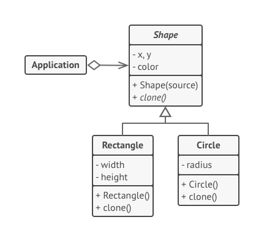

## Prototype Pattern
**Prototype** is a creational design pattern that lets you copy existing objects without making your code dependent on their classes.

Problems:
 * Can not copy the object to another. Because there may be private part of the class.
 * Since you have to know the object's class to create a dublicate, your code becomes dependent on that class.
 
 

#### Implementation
 * Create the prototype interface and declare the **clone** method.
 * Prototpe class must have copy constructor. In C++ we have copy constructor. But it makes shallow copy. If you use pointer as member, declare a copy constructor and make sure the deep copy of the pointer members.
 * Declare a factory class that stores the concrete prototypes.
