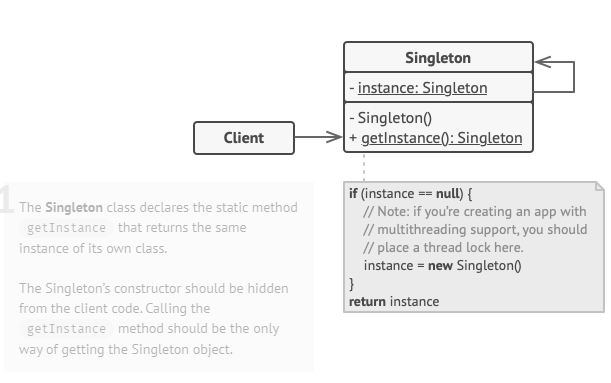

##Singleton Pattern
**Singleton** is a creational design pattern that lets you ensure that a class has only one instance while providing a global a access point to this instance.

Solves 2 problems:
1- Ensure that a class has just a single instance.
2- Provide a global access point to that instance. 

#### Implementation
 * Make the default constructor private, to prevent other objects from using the **new** operator with the Singleton class.
 * Create a static creation method that acts as a consructor. This method calls the private constructor to create an object and saves it in a static field. All following calls to this method return the existence object.

UML Diagram:
 

 Cons:
 - Violates the *Single Responsibility Principle*.
 - In multithread enviroment, it requires the special implementation.
 - It may be difficult to unit test the client code of the Singleton.